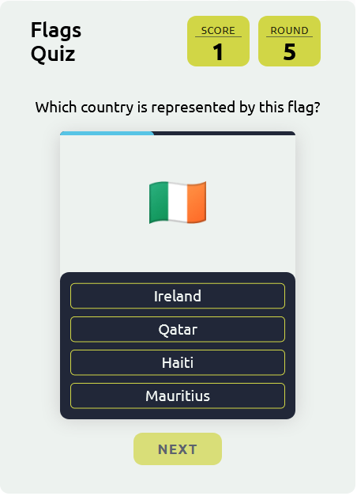

# Country Flags Quiz

A fun and engaging quiz of guessing random country flags. Quiz engine is built from scratch as a custom React hook. File structure and components follow the _separation of concerns_ philosophy.

## Table of contents

-   [Features](#features)
-   [Links](#links)
-   [Technologies](#technologies)
-   [Wokflow](#workflow)
-   [Sources](#sources)
-   [Screenshots](#screenshots)
-   [Author](#author)

## Features

-   Appealing design and visual effects
-   Intuitive UX flow
-   Custom progess bar built from scratch
-   In-game and final score display
-   Maybe you'll get to know a flag or two you've never seen before 😊

## Links

-   [Live website](https://tkulic.github.io/react-flags-quiz/)

## Technologies

-   HTML5
-   CSS3
-   React JS library:
    -   Functional components
    -   React hooks
    -   Custom hooks

## Workflow

1. Project initialization as a public repository on GitHub
2. Planning out components structure and state management
3. Creating functional React components
4. Writing the stylsheet and testing the layout with placeholder data
5. Implementing quiz logic by following the _separation of concerns_ philosophy
6. Configuring repository to publish code with GitHub Pages

## Sources

-   [Flagcdn.com](https://flagcdn.com/) for embedding flags
-   [canvas-confetti](https://www.npmjs.com/package/canvas-confetti) package for visuals effects

## Screenshots

## Author

-   GitHub profile - [Toni Kulić](https://github.com/tkulic)
